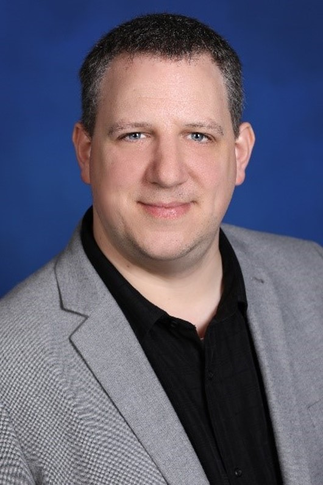

# Meet the FastTrack for Azure team!

See all the team [here](../README.md).

## Glen Small – Sr. FastTrack Engineer 

Glen’s areas of focus include High Availability, resiliency and enterprise scalability.  Glen has extensive experience designing and engineering high performance data platform solutions with High Availability/Disaster Recovery at their core and has worked with numerous global companies in Finance, Retail, Defense and Intelligence to help them achieve success.

Glen has been an architect for 18 years, 9 of which have been with Microsoft.  Before Joining Microsoft, Glen worked as a solutions architect for Fujitsu (ICL) designing end to end infrastructure and High-Performance Computing solutions.

Glen is a keen archer and competes in the UK at county level in Target Archery.

