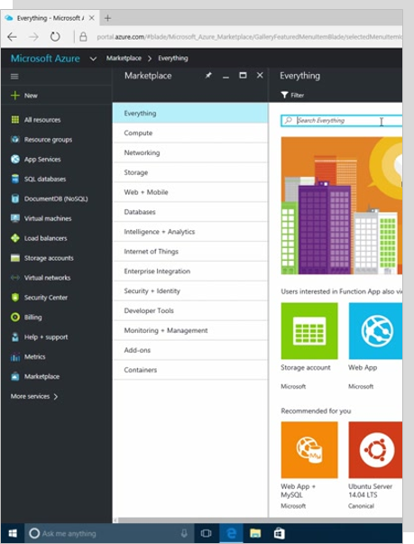

###### Go back to [IaaS Fundamentals](0-iaas-fundamentals.md#delivery-guide)

# Azure Resource Manager

## What is Azure Resource Manager (ARM)?

* [Azure Resource Manager overview](https://docs.microsoft.com/en-us/azure/azure-resource-manager/resource-group-overview) 
* [Terminology](https://docs.microsoft.com/en-us/azure/azure-resource-manager/resource-group-overview#terminology)
* [The benefits of using Resource Manager](https://docs.microsoft.com/en-us/azure/azure-resource-manager/resource-group-overview#the-benefits-of-using-resource-manager)

## Resource group

* [Resource Groups](https://docs.microsoft.com/en-us/azure/azure-resource-manager/resource-group-overview#resource-groups) 
* [Move resources to new resource group or subscription](https://docs.microsoft.com/en-us/azure/azure-resource-manager/resource-group-move-resources)

## Walkthrough: Resources in Azure (Resource Explorer)

* Open the **Azure Portal** https://portal.azure.com.
* On the Search option (top bar) type **Resource Explorer**.
* Pick/expand one of your subscriptions and then Resource Groups.
* Pick/expand one of your resource groups and expand Resources.
* You’ll find all of the Azure resources created in this Resource Group.
* Click in one of the resources and click Open blade (right window) to see the management experience of that resource.

## Deployment and management tools

Briefly explore tools to deploy and manage resource in ARM:

| Azure Portal  | Azure PowerShell | Azure CLI  | Azure Rest API | ARM Template |
| ------------- | ------------- | ------------- |------------- | ------------- |
|  |  |  |  |  |

More resources:
* [Azure PowerShell](https://docs.microsoft.com/en-us/powershell/azure)
* [Azure CLI](https://docs.microsoft.com/en-us/cli/azure/overview)
* [Azure Rest API](https://docs.microsoft.com/en-us/rest/api/)
* [ARM Template](https://docs.microsoft.com/en-us/azure/azure-resource-manager/resource-group-overview#template-deployment)

## ARM templates

> **SHOW** [ARM Template](https://docs.microsoft.com/en-us/azure/azure-resource-manager/resource-group-overview#template-deployment)

> *Navigation*: https://azure.com > Documentation > Products > Monitoring + Management > Azure Resource Manager > Template deployment(https://docs.microsoft.com/en-us/azure/azure-resource-manager/resource-group-overview#template-deployment) 

Explore the following topics:
* What is an ARM template
* ARM template example

> **SHOW** [Azure Quickstart Templates](https://azure.microsoft.com/en-us/resources/templates/)

> *Navigation*: https://azure.com > Resources > Templates

More resources:
* [Export an Azure Resource Manager template from existing resources](https://docs.microsoft.com/en-us/azure/azure-resource-manager/resource-manager-export-template)

###### Go back to [IaaS Fundamentals](0-iaas-fundamentals.md#delivery-guide)