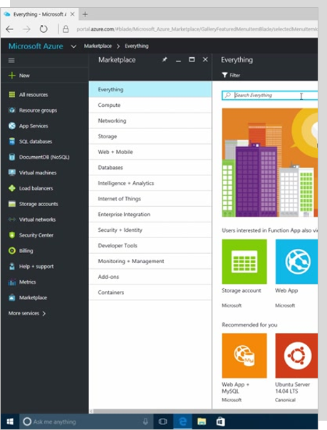
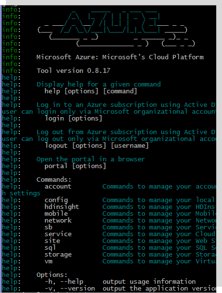

###### Go back to [IaaS Fundamentals](iaas-fundamentals.md#delivery-guide)

# Azure Resource Manager

## What is Azure Resource Manager (ARM)?

> **SHOW** [Azure Resource Manager overview](https://docs.microsoft.com/en-us/azure/azure-resource-manager/resource-group-overview) 

> *Navigation*: https://azure.com > Documentation > Products > Monitoring + Management > [Azure Resource Manager](https://docs.microsoft.com/en-us/azure/azure-resource-manager/resource-group-overview) 

Explore the following topics:
* What is Azure Resource Manager (ARM)?
  * Azure Resource Manager or ARM is a consistent model/framework for creating, managing and monitoring resources in Azure, across all the different tools you can use (Azure PowerShell, Azure CLI, Azure portal, REST API, and development tools).
* [Terminology](https://docs.microsoft.com/en-us/azure/azure-resource-manager/resource-group-overview#terminology)
* [The benefits of using Resource Manager](https://docs.microsoft.com/en-us/azure/azure-resource-manager/resource-group-overview#the-benefits-of-using-resource-manager)

## Resource group

> **SHOW** [Resource Groups](https://docs.microsoft.com/en-us/azure/azure-resource-manager/resource-group-overview#resource-groups) 

> *Navigation*: https://azure.com > Documentation > Products > Monitoring + Management > Azure Resource Manager > [Resource Groups](https://docs.microsoft.com/en-us/azure/azure-resource-manager/resource-group-overview#resource-groups) 

Explore the following topics:
* Important factors to consider when defining your resource group.

More resources:
* [Move resources to new resource group or subscription](https://docs.microsoft.com/en-us/azure/azure-resource-manager/resource-group-move-resources)

## Walkthrough: Resources in Azure (Resource Explorer)
> [LINK MISSING] Reference Walkthrough on customer Resource Manager page

## Deployment and management tools

Briefly explore tools to deploy and manage resource in ARM:

| Azure Portal  | Azure PowerShell | Azure CLI  | Azure Rest API | ARM Template |
| ------------- | ------------- | ------------- |------------- | ------------- |
|  |  |  |  |  |

More resources:
* [Azure PowerShell](https://docs.microsoft.com/en-us/powershell/azure)
* [Azure CLI](https://docs.microsoft.com/en-us/cli/azure/overview)
* [Azure Rest API](https://docs.microsoft.com/en-us/rest/api/)
* [ARM Template](https://docs.microsoft.com/en-us/azure/azure-resource-manager/resource-group-overview#template-deployment)

## ARM templates

> **SHOW** [ARM Template](https://docs.microsoft.com/en-us/azure/azure-resource-manager/resource-group-overview#template-deployment)

> *Navigation*: https://azure.com > Documentation > Products > Monitoring + Management > Azure Resource Manager > Template deployment(https://docs.microsoft.com/en-us/azure/azure-resource-manager/resource-group-overview#template-deployment) 

Explore the following topics:
* What is an ARM template
* ARM template example

## Walkthrough: Azure Templates (Azure Docs and GitHub)

> Source: Ready session | Digital Ready Boot Camp: Azure Compute (IaaS/VM/Scale Sets) | min 03:13

* Open **Azure website** https://azure.microsoft.com/en-us/ 
* On the top menu click on **Resources**.
* On the Azure resources page click on **Templates**.
* You should see the **Azure Quickstart Templates** page/gallery.
* Let’s search, for example, for one template regarding virtual networks.
* Type vnet on the search box and click Enter.
* Pick one example and click on the title to open the template to see the details.
* Show the template details (input parameters, how to deploy the template using PowerShell or Command Line Interface).
* All the templates are stored on GitHub. To go to the template on GitHub, click on **Browse on GitHub** option (use right-click and open in a new tab option).
* On the GitHub Page, click on the .json file to see the actual content of the template.
* Go back to the template page on the Azure site and click on **Deploy to Azure**, to show how to directly deploy the template from here to the Azure portal.
* To deploy the template, we’ll be prompt to add all the input values for the input parameters defined on the template (such as, the name of the Resource Group, name of the Virtual Network, etc.).

More resources:
* [Export an Azure Resource Manager template from existing resources](https://docs.microsoft.com/en-us/azure/azure-resource-manager/resource-manager-export-template)

###### Go back to [IaaS Fundamentals](iaas-fundamentals.md#delivery-guide)